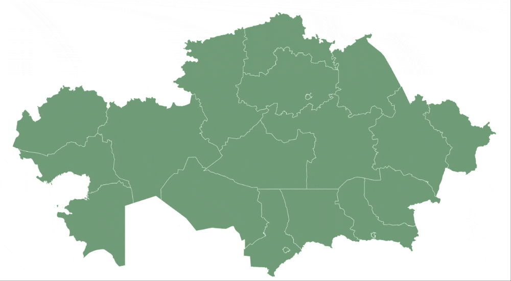

# Интерактивная карта с информацией о регионах

## Описание

Этот проект представляет собой интерактивную **SVG-карту**, на которой пользователи могут:

- Наводить курсор на регионы и получать информацию о них.
- Открывать модальное окно с дополнительными данными.

## Функционал

- **Наведение на регион**:  
  При наведении на область SVG-карты отображается всплывающее окно с названием региона, его ID и статусом.

- **Изменение прозрачности**:  
  Если регион имеет статус `"inactive"`, он становится **полупрозрачным**.

- **Клик по региону**:  
  Открывается **модальное окно** с подробной информацией о городе или области:

  - Название
  - Население
  - Количество учебных заведений
  - Площадь
  - Описание

- **Загрузка данных из JSON**:  
  Информация о городах и регионах загружается из файла `inform.json`.

## Использование

1. Открыть проект в браузере.
2. Навести курсор на регион, чтобы увидеть его данные.
3. Кликнуть на регион для открытия модального окна с подробной информацией.

